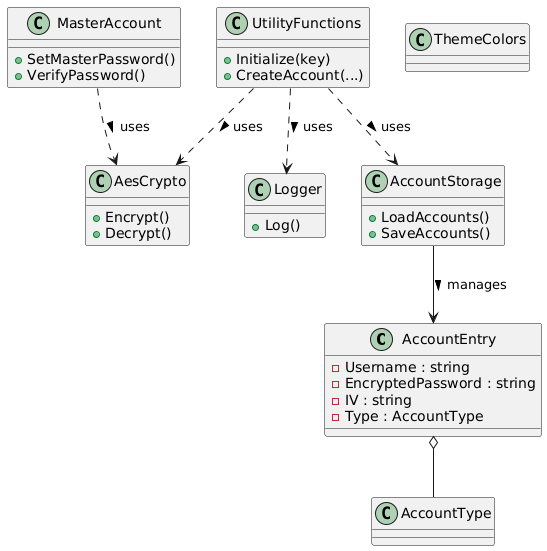

# LockIn

LockIn is a secure password manager desktop application built with C# and Windows Forms, targeting .NET 10. It allows users to store, encrypt, and manage account credentials for various services with a modern, user-friendly interface.

## Features
- Secure AES-256 encryption for all stored passwords
- User authentication with master password
- Add, edit, and delete account entries
- Search and filter accounts
- Customizable dark and light themes
- Owner-drawn DataGridView for enhanced UI
- Encrypted data storage in JSON format

## Getting Started

### Prerequisites
- .NET 10 SDK or later
- Visual Studio 2022/2026 or compatible IDE

### Build and Run
1. Clone the repository:
   ```
   git clone https://github.com/lukebaldovino/LockIn.git
   ```
2. Open the solution in Visual Studio.
3. Build the solution.
4. Run the application (F5 or Ctrl+F5).

## Usage
- On first launch, set your master password.
- Add new accounts with service name, username/email, and password.
- Click the "View" button to reveal the decrypted password (after login).
- Use the search bar to quickly find accounts.
- Switch between dark and light mode using the toggle button.

## Security
- All passwords are encrypted using AES-256 before being saved.
- The encryption key is derived from the master password and never stored in plain text.
- The app does not transmit or sync data to any server; all data is local.

## Project File Structure
- `Program.cs` — Application entry point, handles startup and form selection.
- `Form1.cs` / `Form1.Designer.cs` — Main dashboard UI and logic (Dashboard form).
- `Form2.cs` / `Form2.Designer.cs` — Add account form UI and logic.
- `LogInForm.cs` / `LogInForm.Designer.cs` — Login form UI and logic.
- `RegisterForm.cs` / `RegisterForm.Designer.cs` — Registration form UI and logic.
- `backend/` — Core backend logic:
  - `account_entry.cs` — Account data model (OOP: encapsulation, constructors).
  - `account_storage.cs` — Handles saving/loading accounts to/from JSON.
  - `aes_crypto.cs` — AES-256 encryption/decryption utilities (OOP: static utility class).
  - `utility_functions.cs` — High-level account management (OOP: abstraction).
  - `master_account.cs` — Master password and key management.
  - `logger.cs` — File-based logging utility (OOP: static utility class).
  - `theme_colors.cs` — Centralized theme color management.
  - `test.cs` — Test utilities for backend logic.
- `accounts.json` — Encrypted account data (created at runtime).
- `logs.txt` — Application logs (created at runtime).

## UML Class Diagram

Below is a UML class diagram representing the main classes and their relationships in LockIn. This diagram focuses on the backend logic and how the core classes interact.



## OOP Principles Applied
- **Encapsulation:**
  - `AccountEntry` class encapsulates account data and provides constructors for initialization.
  - `AesCrypto`, `Logger`, and `AccountStorage` encapsulate related functionality as static classes.
- **Abstraction:**
  - `UtilityFunctions` provides high-level methods for account management, hiding encryption and storage details.
  **Inheritance**
  - Forms are inherited for reusability
  - 
- **Separation of Concerns:**
  - UI logic is separated from backend logic (forms vs. backend folder).
- **Single Responsibility Principle:**
  - Each class (e.g., `AccountEntry`, `Logger`, `AesCrypto`) has a clear, single responsibility.
- **Reusability:**
  - Utility classes like `AesCrypto` and `Logger` are reusable across the application.

**Example:**
```csharp
// Encapsulation and abstraction in AccountEntry
public class AccountEntry
{
    public string Username { get; set; }
    public string EncryptedPassword { get; set; }
    public string IV { get; set; }
    public AccountType Type { get; set; }
    public AccountEntry(string username, string encryptedPassword, string iv, AccountType type) { ... }
}

// Abstraction and single responsibility in UtilityFunctions
public static class UtilityFunctions
{
    public static void Initialize(byte[] key) { ... }
    public static (string serviceKey, string username) CreateAccount(...) { ... }
    // ...
}
```

## Contributing
Pull requests are welcome. For major changes, please open an issue first to discuss what you would like to change.

## License
This project is licensed under the MIT License.